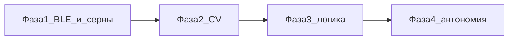

# Дорожная карта проекта «Автоматический тетрис» (Android + ESP32)

Краткое описание цели: смартфон (камера + логика) и ESP32 с сервоприводами физически нажимают кнопки карманного тетриса без вмешательства в устройство. Подробнее: [README.md](README.md).

---

## Инструкция для ИИ-агента и разработчика

1. **Перед началом задачи** просмотри этот файл: актуальная фаза, протокол BLE, что уже закрыто.
2. **После завершения значимого шага** (новая прошивка, новый протокол, экран приложения, модуль CV и т.п.):
   - отметь выполненные пункты (`[ ]` → `[x]`);
   - при необходимости скорректируй формулировки следующих шагов;
   - добавь строку в раздел [Журнал прогресса](#журнал-прогресса) (дата по `Today's date` в сессии, кратко что сделано, затронутые пути).
3. Не удаляй историю журнала — только дополняй сверху (новые записи выше старых).

Текущий BLE-протокол (первый байт записи в характеристику `ffe1`, см. `BleTetrisConfig` в приложении):

| Байт | Значение        | Прошивка |
|------|-----------------|----------|
| `0x01` | Мигание встроенного LED | Step1, Step2, Step3 |
| `0x02` | Тап «влево» (GPIO 13) | Step2 (один серво), Step3 |
| `0x03` | Тап «вправо» (GPIO 12) | Step3 |
| `0x04` | Тап «поворот» (GPIO 14) | Step3 |
| `0x05` | Тап «вниз» (GPIO 27) | Step3 |

---

## Журнал прогресса

| Дата | Изменение |
|------|-----------|
| 2026-04-19 | Фаза 2 (старт): CameraX превью + `ImageAnalysis`, ROI (слайдеры, оверлей, `rememberSaveable`), заглушка `StubPlayfieldAnalyzer`, модели `NormalizedRoi` / `PlayfieldSnapshot`, вкладка «Камера» в `MainActivity`, `CameraCaptureScreen.kt`, разрешение `CAMERA`. |
| 2026-04-19 | Step3: четыре серва GPIO 13/12/14/27, команды `0x02`..`0x05`; скетч `Arduino/TetrisBLE_Step3_FourServos/`, Android: `BleTetrisConfig`, четыре кнопки тапа в `MainActivity`. |
| 2026-04-19 | BLE Step1 (подключение + мигание), Android: скан, GATT, кнопка мигания. Step2: команда `0x02`, серво GPIO 13, `writeCommand` / «Тап сервой». |

---

## Фаза 0 — Инфраструктура и железо (частично)

- [x] Репозиторий: Android-приложение (Kotlin, Compose), примеры Arduino в `Arduino/`
- [x] Общая документация по железу и архитектуре ([README.md](README.md))
- [ ] Стабильная механическая сборка (крепление телефона, тетриса, четырёх серв)
- [ ] Питание 5 V / общий GND — проверено под нагрузкой четырёх серв

---

## Фаза 1 — Связь телефон ↔ ESP32 и исполнитель

- [x] BLE peripheral: сервис/характеристика, имя устройства, совместимость с приложением ([TetrisBLE_Step1_Connect.ino](Arduino/TetrisBLE_Step1_Connect/TetrisBLE_Step1_Connect.ino))
- [x] Android: разрешения, скан по UUID, подключение, обнаружение сервиса (`BleTetrisClient`, `MainActivity`)
- [x] Команда теста: мигание LED (`0x01`)
- [x] Один сервопривод по BLE: тап (`0x02`), прошивка [TetrisBLE_Step2_OneServo.ino](Arduino/TetrisBLE_Step2_OneServo/TetrisBLE_Step2_OneServo.ino)
- [x] Четыре серва на разных GPIO: протокол команд «влево / вправо / поворот / вниз» (или ID кнопки + действие «тап») — [TetrisBLE_Step3_FourServos.ino](Arduino/TetrisBLE_Step3_FourServos/TetrisBLE_Step3_FourServos.ino)
- [ ] Прошивка «боевой» контроллер (один скетч или чёткая нумерация версий), калибровка импульсов под конструкцию
- [ ] По желанию: `notify()` с подтверждением/ошибкой на телефон; неблокирующий `loop` при серии команд

---

## Фаза 2 — Захват и понимание картинки с камеры

- [x] Захват превью/кадра (CameraX или аналог), стабильный ROI области экрана тетриса
- [ ] Предобработка (обрезка, масштаб, бинаризация при необходимости) — задел: `FramePreprocessor`, без конвертации YUV
- [ ] Распознавание сетки/фигур или упрощённый конвейер под конкретную модель тетриса
- [x] Выход в код: структура «игровое состояние» (матрица, текущая фигура, следующая — по мере необходимости) — `PlayfieldSnapshot` / `CellKind`, пока заглушка анализатора

---

## Фаза 3 — Логика игры и решения

- [ ] Модель правил / симуляция ходов (или интеграция лёгкой библиотеки)
- [ ] Политика выбора хода (эвристика / поиск / заготовка под ML)
- [ ] Связка: состояние с камеры → решение → очередь команд на ESP32

---

## Фаза 4 — End-to-end и качество

- [ ] Автономный цикл: съёмка → анализ → команды → сервы с безопасными паузами
- [ ] Обработка сбоев (потеря BLE, таймаут кадра, нераспознанное поле)
- [ ] Настройки в приложении (задержки, калибровка ROI, повтор подключения)

---

## Справка: ключевые пути в репозитории

| Область | Путь |
|---------|------|
| BLE-клиент | `app/src/main/java/ru/adigital/tetris/ble/BleTetrisClient.kt` |
| UI подключения / тестов | `app/src/main/java/ru/adigital/tetris/MainActivity.kt` |
| Камера, ROI (Фаза 2) | `app/src/main/java/ru/adigital/tetris/ui/CameraCaptureScreen.kt` |
| Модели поля / CV | `app/src/main/java/ru/adigital/tetris/vision/` |
| Прошивка минимум (LED) | `Arduino/TetrisBLE_Step1_Connect/` |
| Прошивка LED + один серво | `Arduino/TetrisBLE_Step2_OneServo/` |
| Прошивка LED + четыре серва (тапы) | `Arduino/TetrisBLE_Step3_FourServos/` |
| Пример серво без BLE | `Arduino/Servo_SG90_D13/` |

---

## Зависимости между фазами (кратко)

Механику (Фаза 0) можно развивать параллельно с Фазой 1–2.
